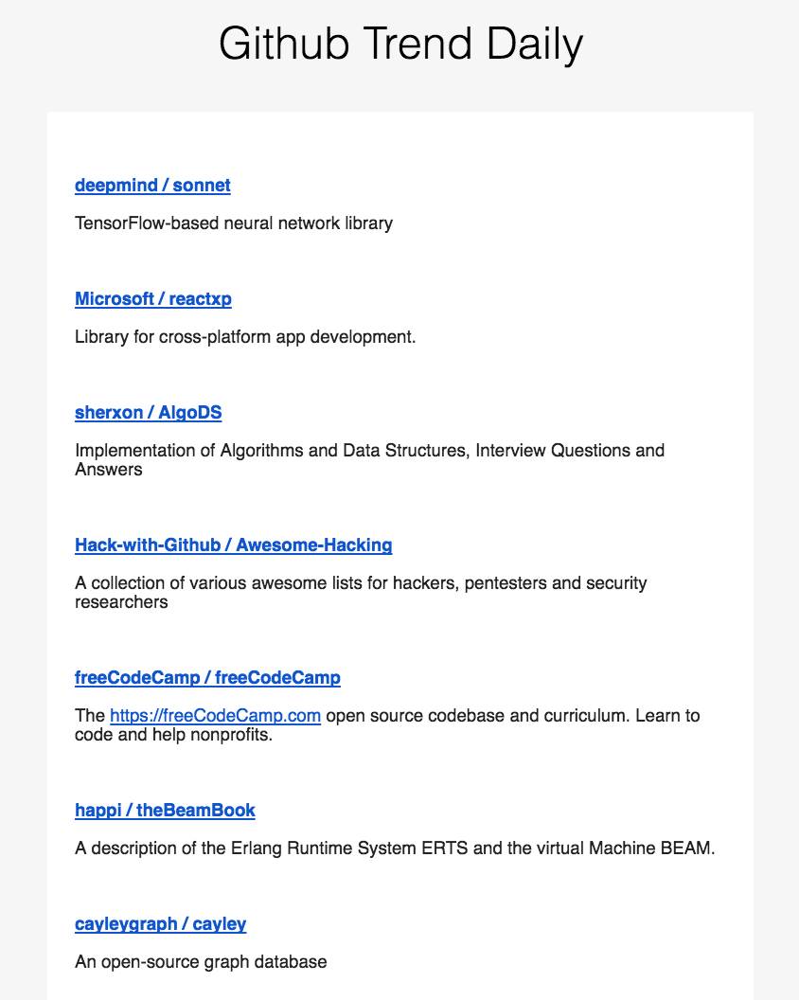
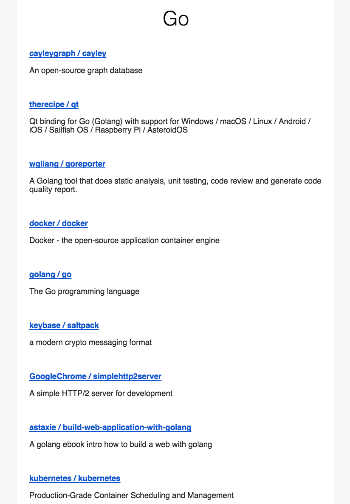

# ghtrend
Github Trend - Sends yourself a github trending email every day.

# Preview
<p align="center">
  
  
</p>

# Get started
```bash
# Here we use some env variables to configure the ghtrend

# your gmail account
# userEmail=username@gmail.com
# userPassword=123456

# your languages preference, separated by ","
# languages=go,python,javascript

docker run \
  -e "userEmail=username@gmail.com" -e "userPassword=123456" \ 
  -e "languages=go,python,javascript" \
  -d zhouzhuojie/ghtrend
```
